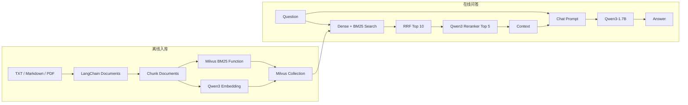

# LangChain RAG 架构说明

本文说明 `langchain-rag` 的模块职责、对象关系与数据流。项目包含两条相互独立但共享 Milvus Collection 的流程：

```text
离线流程：原始文件 → Document → Chunk → Milvus

在线流程：Question → 混合检索 → RRF → Reranker → Prompt → LLM → Answer
```

## 1. 总体架构



离线流程负责建立可检索的数据；在线流程只读取已有 Collection，不重新解析全部文件。

## 2. 模块职责

| 文件 | 核心职责 | 主要输入 | 主要输出 |
|---|---|---|---|
| `ingest.py` | 加载、切分、建库、建 Collection、入库 | 文件路径 | Milvus Collection |
| `retriever.py` | 配置 Dense + BM25 + RRF | Question | `List[Document]` |
| `reranker.py` | 对召回结果重排并截取 Top N | Question、候选 Documents | `List[Document]` |
| `generator.py` | 初始化本地 LangChain ChatModel | Messages | `AIMessage` |
| `rag.py` | 格式化 Context 并组装 LCEL Chain | Question | Answer 字符串 |
| `demo.py` | 首次自动入库并提供交互入口 | 用户输入 | 终端回答 |

模块依赖方向：

```text
demo.py
├── ingest.py
├── retriever.py
├── reranker.py
├── generator.py
└── rag.py
```

各模块可以独立运行验证，但最终入口是：

```bash
python demo.py
```

## 3. 离线入库流程

### 3.1 文件加载

`load_documents()` 根据扩展名选择加载方式：

```text
.txt / .md
→ 整个文件生成一个Document

.pdf
→ 每一页生成一个Document
```

统一输出：

```python
Document(
    page_content="原始文本",
    metadata={
        "source": "文件路径",
        "page": 0,
    },
)
```

TXT 和 Markdown 没有 `page`；PDF 的 `page` 从 0 开始。

### 3.2 文档切分

`RecursiveCharacterTextSplitter` 接收原始 Documents：

```text
List[Document]
→ split_documents()
→ List[Document]
```

切分后的每个 `Document` 表示一个 chunk：

```python
Document(
    page_content="chunk文本",
    metadata={
        "source": "文件路径",
        "page": 0,
        "start_index": 500,
    },
)
```

默认参数：

```text
chunk_size = 500
chunk_overlap = 50
add_start_index = True
```

当前长度单位由 `RecursiveCharacterTextSplitter` 默认长度函数决定，即 Python 字符串长度，不是模型 token 数。

### 3.3 Database 与 Collection

`create_database()` 首先连接 Milvus，然后保证 Database 存在：

```text
Milvus
└── rag_demo
    └── rag_chunks
```

Collection 使用自动整数主键：

```text
auto_id = True
```

应用程序不需要为每个 Document 提供 `pk`。

### 3.4 Schema

```text
rag_chunks
├── pk       INT64
├── text     VARCHAR
├── dense    FLOAT_VECTOR
└── sparse   SPARSE_FLOAT_VECTOR
```

字段关系：

```text
Document.page_content → text
Qwen3 Embedding       → dense
BM25(text)            → sparse
Document.metadata     → 动态字段
```

`dense` 的维度不写死在主流程中，而是通过：

```python
embedding_dim = len(embeddings.embed_query("测试"))
```

根据当前 Embedding 模型实际输出确定。

`sparse` 不声明固定 `dim`。Milvus 只保存非零的稀疏坐标与权重。

### 3.5 两种向量的生成位置

Dense 在 Python 客户端生成：

```text
text
→ HuggingFaceEmbeddings
→ Qwen3-Embedding-0.6B
→ dense vector
→ Milvus
```

BM25 Sparse 在 Milvus 服务端生成：

```text
text
→ Chinese Analyzer
→ BM25 Function
→ sparse representation
```

因此项目中同时存在：

```python
embedding_function=embeddings
```

和：

```python
builtin_function=BM25BuiltInFunction(...)
```

前者描述客户端 Dense 路线，后者描述服务端 BM25 路线。

### 3.6 索引

Dense 字段：

```text
index_type = HNSW
metric_type = COSINE
M = 16
efConstruction = 64
```

Sparse 字段：

```text
index_type = SPARSE_INVERTED_INDEX
metric_type = BM25
```

Collection Schema 中的 `Function` 声明真实的服务端 BM25 Function；传给 LangChain VectorStore 的 `BM25BuiltInFunction` 是同一条服务端能力的 LangChain 包装描述，不会在客户端重复计算一次 BM25。

### 3.7 写入

```python
vector_store.add_documents(documents)
```

写入时：

```text
Document.page_content
├→ 客户端Embedding → dense
└→ Milvus BM25 Function → sparse
```

返回值是 Milvus 自动生成的主键列表。当前代码只打印写入数量，没有把这些 ID 保存到本地文件。

## 4. 在线检索流程

### 4.1 VectorStore

`get_vector_store()` 返回一个 LangChain `Milvus` 对象：

```text
Python中的VectorStore对象
→ 连接rag_demo.rag_chunks
→ 封装添加、删除和检索接口
```

它不是数据库本身，也不会把 Collection 全量复制到 Python 内存。

配置的向量字段：

```python
vector_field=["dense", "sparse"]
```

对应的搜索参数：

```python
[
    {"metric_type": "COSINE", "params": {"ef": 64}},
    {"metric_type": "BM25", "params": {}},
]
```

两个列表按顺序对应：

```text
dense  → COSINE + ef=64
sparse → BM25
```

### 4.2 基础 Retriever

```python
retriever = vector_store.as_retriever(
    search_type="similarity",
    search_kwargs={
        "k": 10,
        "ranker_type": "rrf",
        "ranker_params": {"k": 60},
    },
)
```

其中：

```text
search_kwargs["k"] = 10
→ 最终返回10个Documents

ranker_params["k"] = 60
→ RRF公式中的平滑常数
```

调用：

```python
documents = retriever.invoke(question)
```

数据流：

```text
question
├→ embed_query() → dense search
└→ Analyzer      → BM25 search
                         ↓
                        RRF
                         ↓
                  List[Document]
```

## 5. Reranker

### 5.1 对象关系

```text
ContextualCompressionRetriever
├── base_retriever
│   └── Milvus混合Retriever
└── base_compressor
    └── CrossEncoderReranker
        └── HuggingFaceCrossEncoder
            └── Qwen3-Reranker-0.6B
```

`ContextualCompressionRetriever` 是整个“检索后重排”流程的入口。

### 5.2 执行顺序

```text
question
→ base_retriever.invoke(question)
→ 10个Documents
→ CrossEncoderReranker组织文本对
→ HuggingFaceCrossEncoder计算分数
→ CrossEncoderReranker排序并保留Top 5
→ 5个Documents
```

CrossEncoder 的概念输入：

```python
[
    (question, document_1.page_content),
    (question, document_2.page_content),
]
```

它不会搜索 Milvus，也不知道基础 Retriever 的存在。Retriever 的结果由 `CrossEncoderReranker` 转换为文本对后交给模型。

## 6. 生成模型包装

`generator.py` 包含三层包装：

```text
ChatHuggingFace
└── HuggingFacePipeline
    └── transformers.pipeline
        ├── AutoModelForCausalLM
        └── AutoTokenizer
```

每一层改变的接口：

| 层 | 输入 | 输出 | 作用 |
|---|---|---|---|
| `transformers.pipeline` | 文本 | Transformers 原始生成结果 | 执行模型推理 |
| `HuggingFacePipeline` | 文本 | 文本 | 适配 LangChain LLM 接口 |
| `ChatHuggingFace` | Messages | `AIMessage` | 适配 LangChain ChatModel 接口 |

`HuggingFacePipeline` 不是另一个推理引擎，也没有再次加载模型；它包装已有的 Transformers Pipeline。

当前生成参数：

```text
max_new_tokens = 200
do_sample = False
return_full_text = False
```

## 7. LCEL RAG Chain

### 7.1 文档格式化

重排后的 `List[Document]` 通过 `format_documents()` 转为 Prompt 所需的字符串：

```text
参考资料_1：
第一段内容

参考资料_2：
第二段内容
```

类型变化：

```text
List[Document] → str
```

### 7.2 两条输入路线

```python
{
    "context": rerank_retriever | format_documents,
    "question": RunnablePassthrough(),
}
```

同一个 question 分别产生两个值：

```text
context：
question
→ Retriever
→ Reranker
→ format_documents
→ str

question：
question
→ RunnablePassthrough
→ 原始question
```

最终形成：

```python
{
    "context": "格式化后的参考资料",
    "question": "用户原始问题",
}
```

### 7.3 `|` 的含义

LCEL 使用 Python 运算符重载连接 Runnable：

```text
A | B
```

表示：

```text
A的输出 → B的输入
```

普通函数 `format_documents` 出现在 LCEL 管道中时，会被 LangChain 自动转换为可运行节点。上述字典在管道中会被转换为并行映射节点。

完整类型变化：

```text
str
→ {"context": str, "question": str}
→ ChatPromptValue / Messages
→ AIMessage
→ str
```

最终 Chain：

```python
rag_chain = (
    {
        "context": rerank_retriever | format_documents,
        "question": RunnablePassthrough(),
    }
    | prompt
    | chat_model
    | StrOutputParser()
)
```

## 8. Demo 生命周期

`demo.py` 首先保证 Database 存在，然后检查 Collection：

```text
rag_chunks不存在
→ 加载文档
→ 切分
→ 创建Schema与索引
→ 写入
→ 启动问答

rag_chunks已存在
→ 跳过入库
→ 获取VectorStore
→ 启动问答
```

该判断只检查 Collection 是否存在，不检查：

- Collection 是否为空。
- Schema 是否与当前代码一致。
- 本地文档是否发生变化。
- 模型或切分参数是否发生变化。

当知识库、Schema、模型或切分参数改变时，需要运行：

```bash
python ingest.py
```

当前 `ingest.py` 会删除并全量重建 `rag_chunks`。

## 9. 关键参数

| 阶段 | 参数 | 当前值 |
|---|---|---:|
| Chunk | `chunk_size` | 500 |
| Chunk | `chunk_overlap` | 50 |
| HNSW 构建 | `M` | 16 |
| HNSW 构建 | `efConstruction` | 64 |
| HNSW 搜索 | `ef` | 64 |
| RRF 输出 | `top_k` | 10 |
| RRF 平滑 | `rrf_k` | 60 |
| Reranker 输出 | `top_n` | 5 |
| Generator | `max_new_tokens` | 200 |

这些参数分属不同阶段，不能因为名称相似而混用：

```text
top_k = 10
→ RRF最终结果数量

rrf_k = 60
→ RRF平滑常数

top_n = 5
→ Reranker最终结果数量
```

## 10. 当前边界

该实现用于学习和本地演示，目前没有处理：

- 增量索引和文档更新检测。
- Collection 版本迁移。
- 多租户与权限过滤。
- API 服务、并发和流式输出。
- OCR、表格和复杂 PDF 版面。
- 框架版的独立检索评测。

这些能力不影响当前链路的完整性，但在生产系统中需要单独设计。
